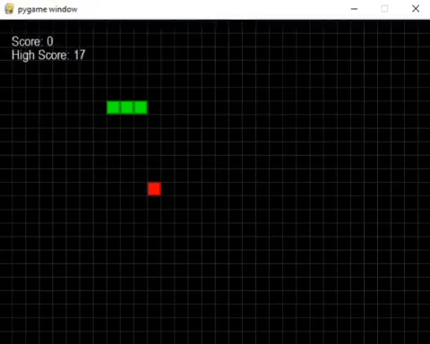

# qlearn_snake
Little snake is learning to survive in this cruel world.

# Introduction
This project is practice on reinforcement learning. Presented here is a well-known game "Snake", which AI is learning to play. During the training program is chosing the action (turn left, turn right or do nothing) based on Q value - choosing the one with maximum expected reward.

Every move that the agent makes, the Q table is updated as below:

##### `New_Q(s, a) = Current_Q(s, a) + LR[Reward(s, a) + DR * maxQ'(s', a') - Q(s, a)]`

_where:_

`New_Q(s, a)` - New Q-value

`Current_Q(s, a)` - Current Q-value

`LR` - Learning Rate

`Reward(s, a)` - Reward

`DR` - Discount Rate

`maxQ'(s', a')` - Maximum predicted reward, given new state and all possible actions

#### The approach is:
* give to a program information about the current position of the snake and apple before each move;
* give a positive reward when snake hits apple;
* give small positive reward if next move brings snake closer to an apple;
* give negative reward if snake hits border or self.

### Current progress
Currently model's avarage score is 12.

 

# TODO
- TODO: create a nice readme

